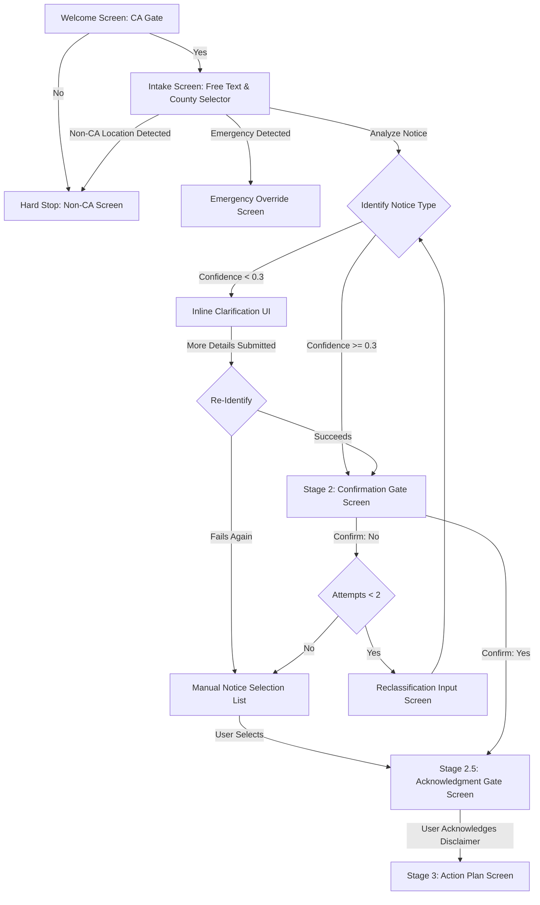

# 🏠 EvictAware — California Tenant Rights Navigator

[](https://www.usaii.org/)
[](https://www.python.org/)
[](https://evictaware.streamlit.app)
[](https://opensource.org/licenses/MIT)

**EvictAware** is an intelligent, tenant-first legal information navigator designed to guide California renters through the critical 24–72 hour window after receiving an eviction notice. Developed by **Team Vision Forge** for the **USAII Global AI Hackathon 2026 (Challenge Brief 4, Undergraduate Track)**, the application helps tenants identify notice types, calculate deadlines, understand legal limitations placed on landlords, and connect with local county-specific legal aid organizations and rental assistance programs.

---

## 📋 Table of Contents
1. [Problem Statement](#-problem-statement)
2. [The Solution](#-the-solution)
3. [Key Constraints & Safeguards](#-key-constraints--safeguards)
4. [System Architecture](#-system-architecture)
5. [The 7-Layer AI Fallback & Failure Mitigation](#-the-7-layer-ai-fallback--failure-mitigation)
6. [Dynamic Cache Date Translation](#-dynamic-cache-date-translation)
7. [Automated Output Validation](#-automated-output-validation)
8. [Codebase Directory Structure](#-codebase-directory-structure)
9. [Local Installation & Setup](#-local-installation--setup)
10. [Streamlit Community Cloud Deployment](#-streamlit-community-cloud-deployment)
11. [Demo Mode (Fresno County Priya Sharma Scenario)](#-demo-mode-fresno-county-priya-sharma-scenario)
12. [Legal Disclaimer](#-legal-disclaimer)

---

## 🚨 Problem Statement

In California, receiving an eviction notice is a terrifying experience. Tenants face a labyrinth of dense legal jargon and incredibly short timelines:
* **Short Timelines**: Many notices (such as a 3-Day Notice to Pay Rent or Quit) give tenants just **3 business days** to respond before a landlord can file a lawsuit.
* **Procedural Complexity**: California landlords must follow strict procedural rules, but tenants often do not know their rights and panic. 
* **Overloaded Systems**: Getting immediate advice from a human lawyer within 24–72 hours is extremely difficult because local legal aid clinics are severely understaffed and backlogged.
* **Information Gap**: Self-represented litigants frequently lose by default simply because they fail to respond to a court summons within the 5-day response window, leading to automatic lockouts.

---

## 🛡️ The Solution

**EvictAware** acts as an immediate, clear, and reassuring emergency navigator. The app:
1. **Intakes User Situations**: Accepts free-text descriptions of the notice in the tenant's own words.
2. **Classifies Notices**: Matches the description against **8 distinct California notice types** using localized regex rules and multi-tier LLM validation.
3. **Generates Urgent Checklist Action Plans**: Provides a clear three-tier checklist (Next 24 Hours, Before Expiry, If Court Papers Are Filed) formatted for a **Grade 7 reading level** to reduce anxiety and increase readability.
4. **Highlights Landlord Prohibitions**: Tells tenants what landlords *cannot* do legally (e.g., self-help lockouts, utility shutoffs, removing belongings).
5. **Connects with Local Legal Aid**: Automatically maps and connects the renter to the exact free legal aid organization, phone number, intake site, and operating hours for their specific California county.

---

## 🔒 Key Constraints & Safeguards

EvictAware is engineered with safety-first legal architecture, ensuring it provides high-quality information without crossing the line into the unauthorized practice of law (UPL):

* **California-Only Scope Lock**: All analysis is restricted to California. The app features a mandatory welcome gate confirming California residency. Furthermore, its intake text scanner detects mentions of non-California states and cities (e.g., Texas, Miami, Florida), blocking access with a clean hard-stop screen.
* **Double Gate Architecture**:
  1. **Confirmation Gate (Stage 2)**: Before showing any plan, the app presents the identified notice type and its plain-language meaning. The user must explicitly confirm if it matches their physical notice document.
  2. **Acknowledgment Gate**: The user must review and click a clear checkbox acknowledging that the system provides legal information only, and is **not a lawyer or legal advice**, before the action plan is rendered.
* **Emergency Overrides**: If the user's intake describes an active emergency—such as an illegal physical lockout (**E1**), domestic violence (**E2**), or shelter crisis (**E3**)—the app immediately halts standard processing, bypasses all AI analysis, and presents emergency hotline contacts (e.g., 911, National Domestic Violence Hotline, 211).
* **Output Validation**: Every LLM response is checked against strict criteria: no outcome predictions (e.g., "you will win"), no definitive legal assurances, a Grade 7 reading level limit (sentence length < 25 words), and the presence of the mandatory legal disclaimer.
* **Zero Hardcoded Content**: No legal content, notice descriptions, county names, phone numbers, or prompts are hardcoded inside the code. Everything is loaded dynamically from structured JSON configuration files under `/data`.

---

## 🏗️ System Architecture

EvictAware uses a structured, state-driven model that transitions screen-by-screen, holding state in a custom class `EvictAwareStateManager` within Streamlit's session state.

### Application Flow Diagram



---

## 🤝 The 7-Layer AI Fallback & Failure Mitigation

To guarantee that a tenant in crisis is *never* met with a broken screen, API error, or timeout, EvictAware uses an industrial-strength **7-layer failover execution queue**. If any layer fails, times out, or returns invalid JSON, the app moves automatically to the next layer:

```
┌───────────────────────────────────────────────────────────┐
│              7-LAYER AI FALLBACK MECHANISM               │
├───────┬───────────────────────────────────────────────────┤
│ L1    │ OpenRouter Key 1 (Gemini 2.5 Flash)               │
├───────┼───────────────────────────────────────────────────┤
│ L2    │ OpenRouter Key 2 (Gemini 2.5 Flash) - Fallback 1   │
├───────┼───────────────────────────────────────────────────┤
│ L3    │ OpenRouter Key 3 (Gemini 2.5 Flash) - Fallback 2   │
├───────┼───────────────────────────────────────────────────┤
│ L4    │ OpenRouter Key 4 (Gemini 2.5 Flash) - Fallback 3   │
├───────┼───────────────────────────────────────────────────┤
│ L5    │ Google Gemini Native SDK (Gemini 2.0 Flash)        │
├───────┼───────────────────────────────────────────────────┤
│ L6    │ Groq API Client (Llama 3.3 70B Versatile)         │
├───────┼───────────────────────────────────────────────────┤
│ L7    │ Pre-computed Cache Fallback + Dynamic Date Updater│
└───────┴───────────────────────────────────────────────────┘
```

* **Layers 1–4: OpenRouter Rotation**: Uses standard HTTP requests to query `google/gemini-2.5-flash`. The app rotates through 4 distinct hackathon API keys dynamically to mitigate rate limits and key exhaustion.
* **Layer 5: Direct Google Gemini SDK**: Bypasses OpenRouter entirely using `google-genai` calling `gemini-2.0-flash`.
* **Layer 6: Groq Client**: Queries the `llama-3.3-70b-versatile` model on Groq's high-speed API.
* **Layer 7: Pre-computed Cache**: Served from a local static file `demo_cache_priya_nt001.json` as a fail-safe guarantee.

---

## 📅 Dynamic Cache Date Translation

A typical problem with static legal caches in demo modes is that they show hardcoded, stale dates (e.g. *"deadline was June 22, 2026"*). When Layer 7 is invoked under live conditions, a dedicated module (`ai/cache_date_updater.py`) parses the JSON payload and dynamically rewrites all historical dates relative to **today**:
* **Notice Date**: Updated to `today`'s date.
* **Notice Expiry Date**: Recalculated as `today + 3 days` (excluding weekends and court holidays where applicable).
* **Remaining Days**: Updated to the accurate countdown integer.

*Note: In explicit "Demo Mode", the updater is bypassed to keep the dates consistent with pre-verified screenshots, but for API emergency fallbacks, it ensures the user sees accurate information.*

---

## 🔍 Automated Output Validation

Every output generated by the AI client is intercepted and audited by the `EvictAwareOutputValidator` before rendering:

| Check Category | Validation Rule | Action on Failure |
| :--- | :--- | :--- |
| **JSON Parse** | Must parse into a valid JSON object matching the schema. | Automatic retry / re-prompt. |
| **Outcome Neutrality** | Cannot contain predictive phrases (e.g., "you will win", "guaranteed"). | Reprompts LLM to strip certainty. |
| **Reading Level** | Sentences must be short (< 25 words) and readable at Grade 7 level. | Reprompts LLM to simplify wording. |
| **Safeguards** | Must contain the county-specific legal aid contact and disclaimer. | Re-injects missing disclaimer/contacts. |
| **Action Tier Limit** | Action plan lists are capped at a maximum of 3 items per tier. | Truncates or reprompts to avoid overwhelm. |

If validation fails, the app generates a specific re-prompt instruction stating exactly what rules were violated, and attempts a self-correction query once. If the correction fails, it drops down to the next fallback layer.

---

## 📁 Codebase Directory Structure

```
c:\Users\Hafiz Salman Saeed\Desktop\USAII Hackathon\
├── .env                              # Local environment variables (API keys)
├── .gitignore                        # Git configuration
├── requirements.txt                  # Python dependencies
├── pyrightconfig.json                # IDE configuration
├── app.py                            # Streamlit entry point, routing & sidebar
├── .streamlit/
│   ├── config.toml                   # Streamlit configurations (light theme, fonts)
│   └── secrets.toml                  # Streamlit Cloud deployment secrets (git-ignored)
├── config/
│   ├── __init__.py
│   └── settings.py                   # Loads env secrets, rotation keys, and app constants
├── data/
│   ├── __init__.py
│   ├── loader.py                     # Cached JSON loading, validation, and county helpers
│   ├── ai_config.json                # LLM system prompt details, prohibited phrases, disclaimers
│   ├── california_eviction_data.json # Legal statutes, metadata, triggers for 8 notice types (NT001-NT008)
│   ├── landlord_prohibitions.json    # Statutes and descriptions of what landlords cannot do
│   ├── legal_aid_contacts.json       # County contacts, statewide resources, and fallback details
│   └── demo_cache_priya_nt001.json   # Cached Priya Sharma NT001 Fresno scenario
├── core/
│   ├── __init__.py
│   ├── state_manager.py              # State machine: screen advance, emergency/CA checks, notice matcher
│   ├── system_prompt.py              # Master prompt assembler
│   ├── context_injection.py          # Injects active notice database entries into the API payload
│   ├── output_validator.py           # Evaluates LLM responses for JSON, UPL, and reading difficulty
│   └── prompt_library.py             # Emergency scenario content blocks (PE-A, PE-B, PE-C)
├── ai/
│   ├── __init__.py
│   ├── openrouter_client.py          # Layers 1-4: HTTP rotation of 4 API keys for Gemini 2.5 Flash
│   ├── gemini_client.py              # Layer 5: direct call to Gemini 2.0 Flash
│   ├── groq_client.py                # Layer 6: direct call to Groq (Llama 3.3 70B)
│   ├── cache_date_updater.py         # Recalculates cache dates relative to current execution date
│   └── fallback.py                   │ 7-layer fallback execution orchestrator
└── ui/
    ├── __init__.py
    ├── styles.py                     # Premium CSS styling (fonts, gradients, micro-animations)
    ├── components.py                 # Markdown-based cards, headers, borders, source badges
    ├── welcome_screen.py             # Welcome page, CA residency gate
    ├── intake_screen.py              # User description input, county selector, inline clarification UI
    ├── confirmation_screen.py        # Double confirmation and acknowledgment gates
    └── action_plan_screen.py         # High-impact rendering of final action plans
```

---

## 💻 Local Installation & Setup

To run the application locally, follow these steps:

### 1. Prerequisites
Ensure you have **Python 3.8 to 3.12** installed on your system.

### 2. Clone the Repository
```bash
git clone https://github.com/your-username/evictaware.git
cd evictaware
```

### 3. Create a Virtual Environment
**Windows (PowerShell)**:
```powershell
python -m venv venv
.\venv\Scripts\Activate.ps1
```
**macOS/Linux**:
```bash
python3 -m venv venv
source venv/bin/activate
```

### 4. Install Dependencies
```bash
pip install --upgrade pip
pip install -r requirements.txt
```

### 5. Configure Local Environment Variables
Create a file named `.env` in the root of the project:
```ini
# OpenRouter API keys (rotates L1 - L4)
USAII_Hackathon_API1="your_openrouter_key_1"
USAII_Hackathon_API2="your_openrouter_key_2"
USAII_Hackathon_API3="your_openrouter_key_3"
USAII_Hackathon_API4="your_openrouter_key_4"

# Google Gemini native key (L5)
GEMINI_API_KEY="your_google_gemini_key"

# Groq API key (L6)
GROQ_API_KEY="your_groq_key"
```

### 6. Run the Application
```bash
streamlit run app.py
```
Open your browser and navigate to the local address displayed in your terminal (typically `http://localhost:8501`).

---

## ☁️ Streamlit Community Cloud Deployment

To host **EvictAware** on Streamlit Community Cloud, utilize the following steps:

### 1. Local Configuration (.streamlit/config.toml)
To ensure the app maintains its premium light-themed design, configure `.streamlit/config.toml` (already completed in workspace):
```toml
[theme]
primaryColor = "#0D9488"
backgroundColor = "#FFFFFF"
secondaryBackgroundColor = "#F8FAFC"
textColor = "#1E293B"
font = "sans serif"

[server]
headless = true
enableCORS = false
enableXsrfProtection = true
```

### 2. Streamlit Cloud Secrets Management
Streamlit Cloud retrieves credentials using `st.secrets` instead of `.env`.
1. Create a local `.streamlit/secrets.toml` file (do NOT commit this file to Git):
   ```toml
   USAII_Hackathon_API1 = "your_openrouter_key_1"
   USAII_Hackathon_API2 = "your_openrouter_key_2"
   USAII_Hackathon_API3 = "your_openrouter_key_3"
   USAII_Hackathon_API4 = "your_openrouter_key_4"
   GEMINI_API_KEY = "your_google_gemini_key"
   GROQ_API_KEY = "your_groq_key"
   ```
2. When deploying to [Streamlit Community Cloud](https://share.streamlit.io/), copy and paste the contents of your `secrets.toml` into the **Secrets** text box in the application Settings panel.

---

## 🎬 Demo Mode (Fresno County Priya Sharma Scenario)

If you do not have active API keys or want to test the app instantly under offline conditions:
1. Launch the app.
2. Expand the sidebar panel.
3. Toggle the **Demo Mode (Priya's scenario)** switch.

### Priya Sharma's Eviction Notice Scenario
* **Notice Type**: NT001 (Three-Day Notice to Pay Rent or Quit)
* **County**: Fresno County
* **Context**: Priya received a notice on Friday evening claiming she owes $1,200. Her landlord texted her saying the sheriff will throw her out by Tuesday.
* **The Demo Outcome**: The app bypasses external API calls, loads the pre-verified cache (`demo_cache_priya_nt001.json`), and outputs the action plan.
  * Correctly calculates that California law excludes weekends and court holidays, meaning she has until Wednesday to respond, exposing her landlord's threat as an empty scare tactic.
  * Connects her directly with the **Central California Legal Services** office in Fresno with their verified helpline (`559-570-1200`).

---

## ⚖️ Legal Disclaimer

> [!IMPORTANT]
> **EvictAware provides legal information, not legal advice.**
>
> The developers of this application are not attorneys, and the tool does not establish an attorney-client relationship. All content is for educational and navigation purposes. While we strive to maintain accurate summaries, California laws and local city ordinances change frequently. Renters should always verify their legal standing and notices with a licensed attorney or a county legal aid organization before taking action or deciding to move out.
